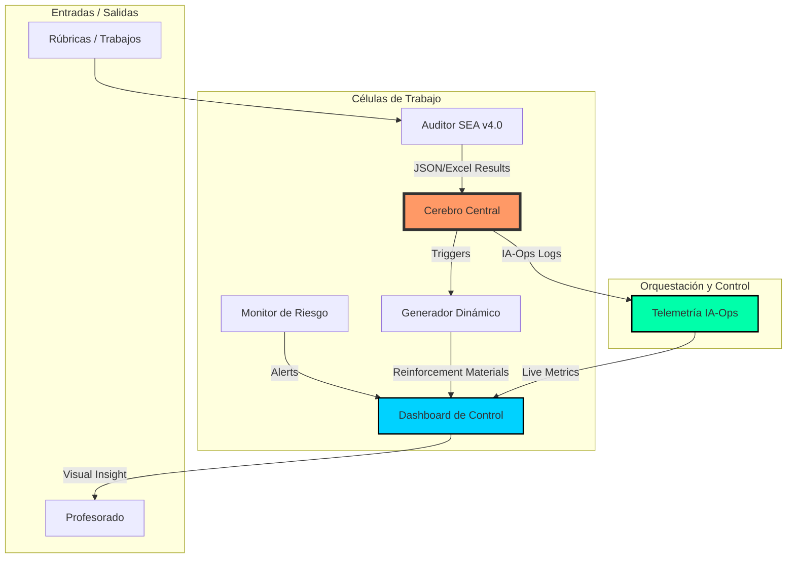

# 🎓 PEDAGOG-IA: Ecosistema Industrial de Automatización

> **Sinfonía Pedagógica Autónoma**: Un ecosistema de células inteligentes diseñado para automatizar la evaluación, el monitoreo y la remediación del aprendizaje mediante Inteligencia Artificial de vanguardia (Gemini/GPT-4).

---

## 🏗️ Arquitectura del Sistema (IA-Ops)

El proyecto opera bajo un modelo de **Células Autónomas** coordinadas por un **Cerebro Central**. La telemetría en tiempo real permite monitorear costes y rendimiento.



---

## 🔄 El Ciclo Pedagógico Completo

La gran potencia de PEDAGOG-IA reside en su **Ciclo de Realimentación Autónoma**:

1.  **Evaluación**: El *Auditor* califica un trabajo basándose en una rúbrica técnica.
2.  **Detección**: El *Cerebro Central* identifica criterios insuficientes (< 6.0).
3.  **Remediación**: Se invoca al *Generador* de forma desatendida.
4.  **Entrega**: Se producen Guías de Estudio y Quizzes específicos para las debilidades del alumno.

---

## 📋 Matriz de Documentos (Inputs / Outputs)

| Célula | Documentos Aceptados | Documentos Generados |
| :--- | :--- | :--- |
| **Auditor** | `.txt`, `.pdf` (Rúbricas y Trabajos) | `.xlsx` (Registro), `.json` (Data para Brain) |
| **Cerebro Central** | `.json` (Resultados de Auditoría) | `.json` (Plan de Refuerzo Autónomo) |
| **Generador** | `.txt`, `.json` (Plan de Temas) | `.txt` (Guía de Estudio), `.json` (Cuestionario) |
| **Monitor** | `.xlsx` (Histórico de notas) | `.json` (Reporte de Riesgo Pedagógico) |
| **Dashboard** | Logs `.jsonl`, JSONs de salida | **Interfaz Web Interactiva** (Gráficos) |

---

## 🚀 Guía de Uso Rápido (Línea de Comandos)

Para una experiencia industrial, utiliza el orquestador principal:

### 1. Ejecutar Ciclo Completo (Evaluación + Refuerzo)
```bash
# Evalúa el trabajo y genera material de refuerzo si hay debilidades
python pedagogia-sync.py full-cycle --file trabajo_alumno.txt
```

### 2. Lanzar Panel de Control (Dashboard Premium)
```bash
# Inicia el servidor web en http://localhost:8000
python cells/dashboard/main.py
```

### 3. Ejecución por Células (Individual)
*   **Auditor**: `python cells/auditor/main.py [trabajo.txt]`
*   **Generador**: `python cells/generator/main.py` (Interactivo)

---

## 📊 IA-Ops: Telemetría y Costes

El sistema registra cada interacción en `data/logs/observability/`. Esto permite:
*   **Control Financiero**: Seguimiento del gasto en USD por modelo (Gemini Pro/Flash).
*   **Latencia**: Medición del tiempo de respuesta de la IA.
*   **Estado**: Auditoría de errores de red o de modelo.

> [!TIP]
> Puedes visualizar estas métricas en tiempo real en la pestaña de **Telemetry Feed** del Dashboard.

---

## 🛠️ Estructura de Carpetas

*   `cells/`: Lógica de negocio de cada componente (Auditor, Generator, etc.).
*   `core/`: Núcleo compartido (Configuración, Inteligencia, Cache).
*   `infra/`: Infraestructura de orquestación, telemetría y workflows de CI/CD.
*   `data/logs/`: Persistencia de eventos y métricas.
*   `output/`: Resultados de evaluaciones y materiales generados.

---
*Generado con ❤️ por el Motor de IA Antigravity | v4.1 Industrial Integration*
