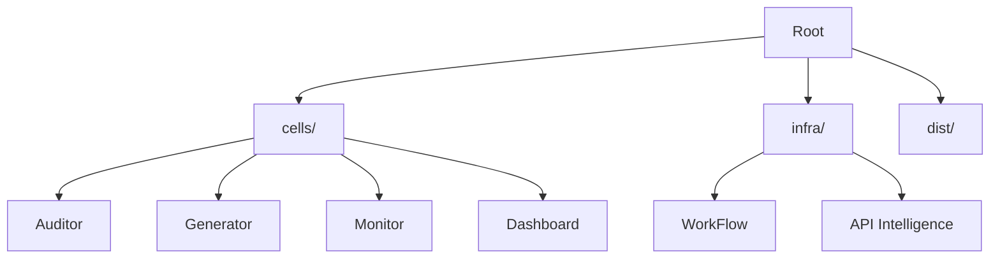

# 🎓 PEDAGOG-IA: Células de Automatización

> **Ecosistema Industrial de Automatización Pedagógica** para profesorado de todos los niveles. Transformando la gestión docente mediante Inteligencia Artificial y Arquitectura Limpia.

---

## 📚 Documentación Estratégica
*   **[MASTER INSTRUCTION](MASTER_INSTRUCTION.md)**: El núcleo de inteligencia y estándares de desarrollo.
*   **[Diario de Bordo](docs/DIARIO_DE_BORDO.md)**: Registro histórico de hitos y soluciones técnicas.
*   **[Análisis Sistémico](docs/DIAGRAMAS_SISTEMICOS.md)**: Arquitectura detallada y flujos de datos.
*   **[Guía del Usuario MVP](Release/GUIA_USUARIO_AUDITOR.md)**: Manual operativo de la célula Auditor.

---

## 🚀 Guía de Ejecución

Existen tres formas de interactuar con el ecosistema PEDAGOG-IA, dependiendo de tu perfil:

### 1. Perfil Usuario (Ejecutables Binarios)
Ideal para despliegue rápido sin dependencias de Python. Los binarios se encuentran en el directorio `dist/`.

| Célula | Versión Slim (Recomendada) | Versión MVP (Completa) |
| :--- | :--- | :--- |
| **Auditor** | `Auditor_Rubricas_Slim.exe` | `Auditor_Rubricas_MVP.exe` |
| **Generador** | `Generador_Material_Slim.exe` | `Generador_Material_MVP.exe` |
| **Monitor** | `Monitor_Riesgo_Slim.exe` | `Monitor_Riesgo_MVP.exe` |
| **Dashboard** | `Dashboard_Competencias_Slim.exe` | -- |

### 2. Perfil Desarrollador (Python Nativo)
Para extender las funcionalidades o realizar depuración en tiempo real.

1. **Instalar Dependencias**:
   ```bash
   pip install -r requirements.txt
   ```
2. **Ejecutar Célula**:
   Navega a la carpeta de la célula y lanza el script principal:
   ```bash
   cd cells/auditor
   python main.py
   ```

### 3. Workflow Industrial (PowerShell)
Suite de automatización para la gestión del ciclo de vida (SDLC) ubicada en `infra/WorkFlow/`.

*   **Sincronización Total**: `./infra/WorkFlow/02_Sincronizar_Todo.ps1`
*   **Gestión de Ramas**: `./infra/WorkFlow/03_Nueva_Rama.ps1`
*   **Publicación de Releases**: `./infra/WorkFlow/08_Publicar_Release.ps1`

---

## 🛠️ Estructura del Ecosistema



---

## 🛡️ Seguridad y Configuración
Asegúrate de configurar tu archivo `.env` basado en el `.env.example` para habilitar las integraciones de IA (Gemini/OpenAI).

---
*Generado con ❤️ por el Motor de IA Antigravity | Estado: Producción Estable v4.0*
