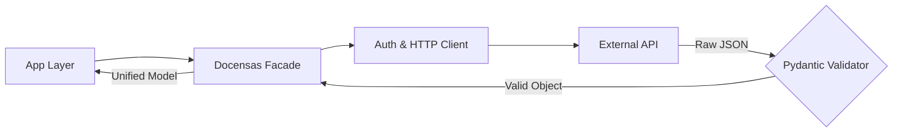

# 🧩 API Intelligence Wrapper: The Facade Revolution

> **"La complejidad es el cementerio de la productividad. El diseño es su rescate."**

## 📖 The Problem
Integrar APIs externas suele ser un caos de diccionarios anidados, formatos de fecha inconsistentes y autenticación repetitiva. Cuando varios desarrolladores atacan la misma API sin un wrapper inteligente, se genera **duplicación de lógica** y errores de validación silenciosos. 

Este activo centraliza la inteligencia de consumo de APIs, convirtiendo JSONs crudos en objetos de negocio validados.

## 🏗️ Architectural Decisions (ADR)
Hemos implementado patrones de diseño para maximizar la robustez:

1.  **Facade Pattern**: Creamos una "fachada" (`DocensasIntelligenceFacade`) que oculta la complejidad del cliente HTTP, los tokens y los filtros manuales. El desarrollador solo llama a `.fetch_active_assets()`.
2.  **Strict Model Validation (Pydantic)**: No confiamos en la API externa. Cada dato que entra es validado contra un esquema. Si la API cambia su estructura, fallamos rápido y con mensajes claros.
3.  **Data Unification**: Usamos `Field(alias=...)` para normalizar nombres de variables extraños (ej: `display_name` a `title`) antes de que lleguen a la capa de aplicación.

## 🔄 Flowchart (Facade Flow)


## ⚖️ Trade-offs
*   **Abstracción vs Control**: Al usar una Facade, el desarrollador pierde control sobre los parámetros HTTP específicos de bajo nivel. Ganamos **velocidad** y **seguridad** a cambio de esa granularidad.
*   **Sobrecarga de Modelado**: Crear modelos Pydantic requiere tiempo inicial, pero elimina el 90% de los errores de `KeyError` en producción.

## 🛠️ The "Human" Factor: How to Use
Simplifica tu vida en 3 líneas:

```python
from api_intelligence_wrapper.facade import DocensasIntelligenceFacade

# 1. Inicializa con tu token
api = DocensasIntelligenceFacade(api_token="tu_token_secreto")

# 2. Obtén datos limpios y validados
assets = api.fetch_active_assets()

# 3. Disfruta del autocompletado y tipado
for asset in assets:
    print(f"{asset.title} - {asset.last_updated.year}")
```

---
**Desarrollado por la Célula de Automatización Docensas.**
*Misión: Domar la complejidad.*
