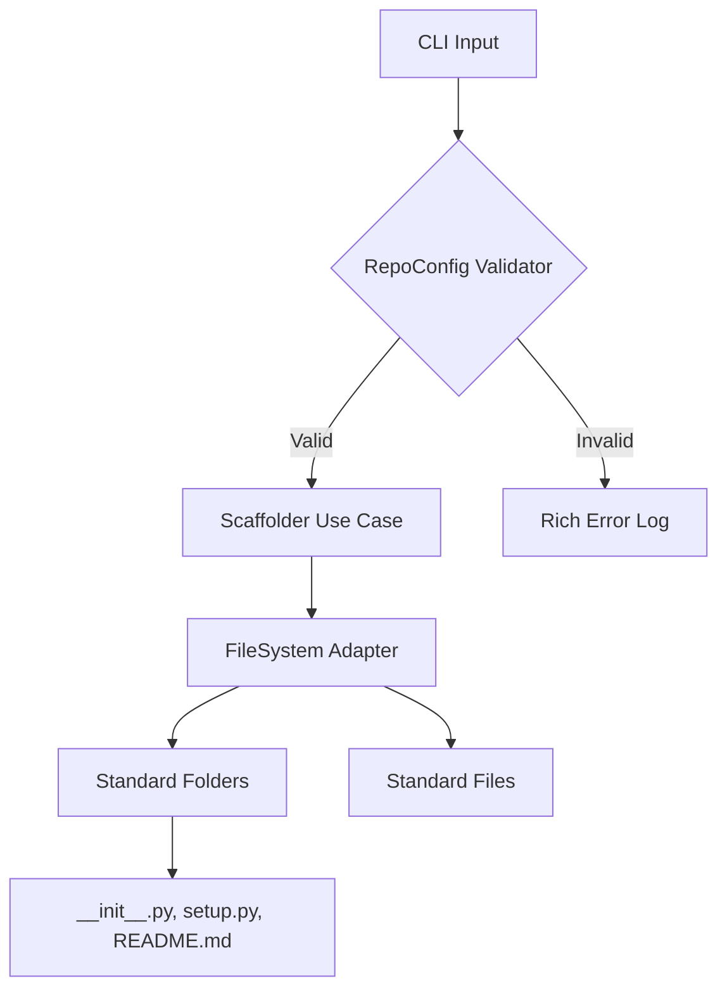

# 🚀 Auto-Repo Scaffolder: Industrial Architecture Standard

> **"Un Senior no escribe código; diseña sistemas que otros pueden escalar."**

## 📖 The Problem
En el vertiginoso mundo de la automatización, la **inconsistencia** es el enemigo silencioso. Iniciar proyectos sin una estructura clara genera deuda técnica, fricción en el equipo y dificulta la mantenibilidad. El `Auto-Repo Scaffolder` resuelve esto estandarizando cada nuevo repositorio de la Célula Docensas bajo los estándares más altos de la industria.

## 🏗️ Architectural Decisions (ADR)
Para este activo, hemos implementado decisiones de diseño críticas:

1.  **Kenneth Reitz Model**: Adoptamos el estándar de facto de la comunidad Python (setup.py en raíz, código en `/module`, tests fuera). Esto garantiza una distribución profesional.
2.  **Clean Architecture (Separation of Concerns)**: Separamos las **Entidades** (Pydantic models) de los **Adaptadores** (Sistemas de Archivos). Esto permite que, en el futuro, podamos cambiar el sistema de archivos local por un bucket de S3 sin tocar la lógica de negocio.
3.  **Strict Typing**: El uso de `mypy` y `typing` no es opcional; es nuestra red de seguridad contra errores en tiempo de ejecución.

## 🔄 Flowchart (Data Flow)


## ⚖️ Trade-offs
*   **Velocidad vs Rigidez**: Sacrificamos la libertad total de estructura por una consistencia absoluta. Esto acelera el onboarding de nuevos ingenieros pero limita experimentos estructurales ad-hoc.
*   **Abstracción de Adaptadores**: Añadir una capa de adaptador para el sistema de archivos añade unas pocas líneas más de código, pero nos da una **flexibilidad de infraestructura** invaluable a largo plazo.

## 🛠️ The "Human" Factor: Install & Run
Instálalo en menos de 2 minutos para empezar a producir activos de alto nivel:

```bash
# 1. Instalar dependencias
pip install -e .

# 2. Ejecutar el scaffolder
scaffold
```

---
**Desarrollado por la Célula de Automatización Docensas.**
*Misión: Automatizar la excelencia.*
