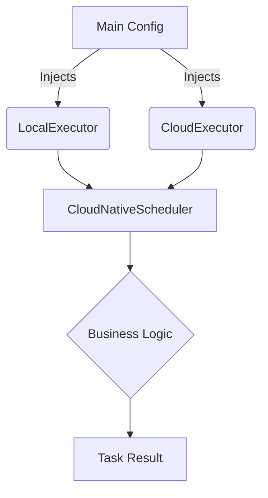

# ☁️ Cloud-Native Task Scheduler: The IoC Paradigm

> **"La infraestructura debe ser un detalle de implementación, no una cadena perpetua."**

## 📖 The Problem
La mayoría de los automatismos nacen acoplados a su entorno. Si escribes un script que usa archivos locales, moverlo a AWS Lambda requiere reescribir gran parte del código. Este acoplamiento genera **rigidez** y dificulta la migración a arquitecturas modernas. 

El `Cloud-Native Task Scheduler` resuelve esto aplicando **Inversión de Control (IoC)**: el programador no decide dónde se ejecuta la tarea, lo decide la configuración.

## 🏗️ Architectural Decisions (ADR)
Diseñamos este activo basándonos en principios SOLID:

1.  **Dependency Injection (DI)**: El `CloudNativeScheduler` recibe su motor de ejecución (`TaskExecutor`) en el constructor. Esto nos permite intercambiar el motor local por uno cloud sin tocar la lógica del scheduler.
2.  **Interface Segregation (ABC)**: Utilizamos clases base abstractas para definir un contrato riguroso. Cualquier nuevo ejecutor (ej: Azure Functions o Docker) solo necesita implementar el método `.run()`.
3.  **Agnosticismo Total**: El core del sistema no importa ninguna librería de cloud (boto3, google-cloud-sdk). Solo importa interfaces locales, manteniendo el paquete ligero y portable.

## 🔄 Flowchart (Dependency Injection)


## ⚖️ Trade-offs
*   **Abstracción vs Debugging**: Al desacoplar la ejecución, el rastreo de errores puede ser más complejo si no hay un buen sistema de logging centralizado. Ganamos **portabilidad** absoluta a cambio de una capa extra de indirección.
*   **Boilerplate Inicial**: Definir interfaces abstractas requiere más archivos al principio, pero evita el "refactor total" cuando el proyecto crece.

## 🛠️ The "Human" Factor: Ready for Any Env
Cambia de entorno simplemente cambiando el objeto inyectado:

```python
from cloud_native_task_scheduler.core.scheduler import CloudNativeScheduler
from cloud_native_task_scheduler.adapters.executors import LocalExecutor, CloudExecutor

# Opción A: Desarrollo Local
scheduler_dev = CloudNativeScheduler(executor=LocalExecutor())
scheduler_dev.schedule_daily_report()

# Opción B: Producción en la Nube
scheduler_prod = CloudNativeScheduler(executor=CloudExecutor())
scheduler_prod.schedule_daily_report()
```

---
**Desarrollado por la Célula de Automatización Docensas.**
*Misión: Desacoplar para escalar.*
