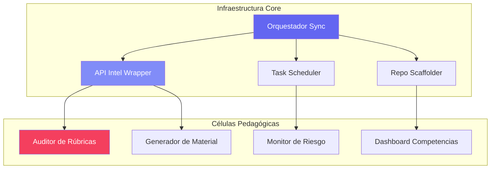
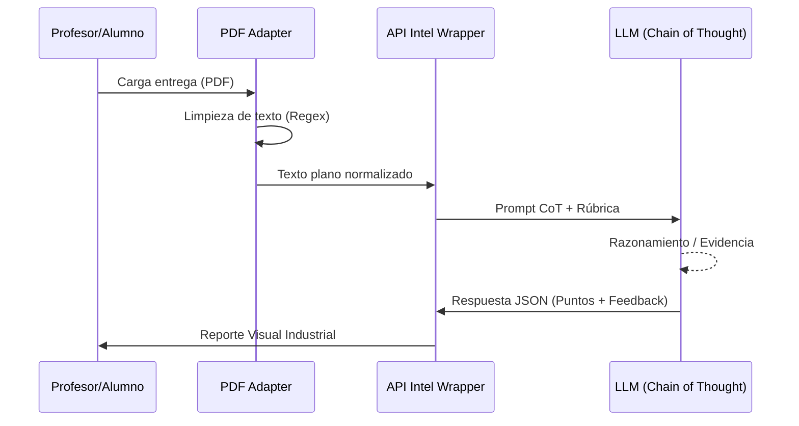
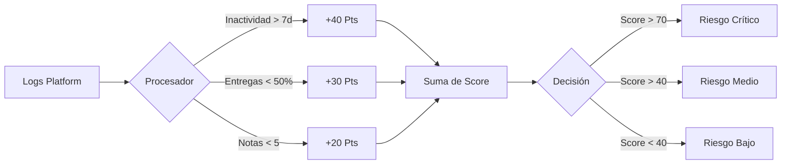

# 📊 Análisis Sistémico: Diagramas Mermaid

Este documento visualiza la lógica y el flujo de datos del ecosistema PEDAGOG-IA antes de su implementación técnica.

## 🏗️ 1. Mapa de Orquestación del Ecosistema
Representa cómo las células de infraestructura soportan a las células pedagógicas.

## 📋 2. Flujo de Valor: Auditor de Rúbricas
Muestra el proceso de transformación de una entrega bruta en un activo pedagógico.

## 🕵️ 3. Lógica del Monitor de Riesgo (EWS)
Visualiza la heurística de decisión para detectar abandono.

---
*Análisis Sistémico v1.0 | Ingeniería Pedagógica*
