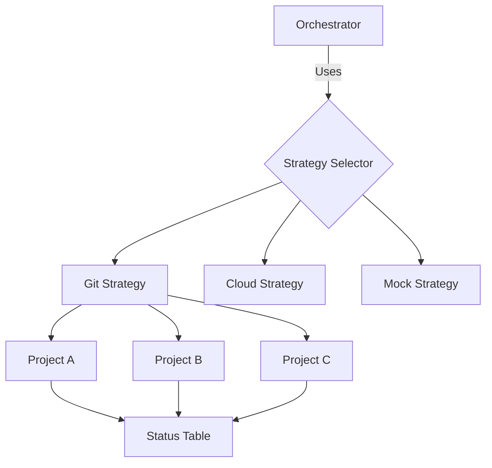

# 🔄 Ecosystem Sync Orchestrator: The Strategy Gatekeeper

> **"Un sistema no está completo hasta que su mecanismo de distribución es tan robusto como su lógica de negocio."**

## 📖 The Problem
Mantener múltiples repositorios o módulos de automatización sincronizados manualmente es una receta para el desastre. La inconsistencia de versiones y la falta de visibilidad sobre qué se ha actualizado generan una "oscuridad operativa". 

El `Ecosystem Sync Orchestrator` centraliza la gestión del estado de toda la Célula Docensas, asegurando que cada activo esté donde debe estar, bajo la estrategia que elijamos.

## 🏗️ Architectural Decisions (ADR)
Para garantizar la máxima flexibilidad, hemos aplicado:

1.  **Strategy Pattern**: El orquestador no está atado a Git. Mediante la interfaz `SyncStrategy`, podemos añadir estrategias de sincronización con AWS S3, Google Drive o servidores FTP sin modificar el motor principal del orquestador.
2.  **Health Dashboard (Rich)**: No solo sincronizamos; visualizamos. El uso de tablas de `Rich` proporciona un informe inmediato del estado de salud de toda la célula al finalizar el proceso.
3.  **Atomic Orchestration**: Tratamos el ecosistema como una entidad única. El orquestador conoce todos los activos (`Scaffolder`, `Wrapper`, `Scheduler`) y aplica la persistencia de forma secuencial y controlada.

## 🔄 Flowchart (Strategy Pattern)


## ⚖️ Trade-offs
*   **Abstracción de Estrategias**: Crear una interfaz de estrategia añade una capa de complejidad al inicio, pero nos permite **migrar de infraestructura de hosting** en minutos en lugar de semanas.
*   **Gestión Centralizada de Proyectos**: La lista de proyectos está hardcodeada por ahora para máxima seguridad, pero esto requiere una actualización manual cuando nace un nuevo activo (Trade-off: Seguridad vs Automatización Total).

## 🛠️ The "Human" Factor: One Command to Rule Them All
Sincroniza todo tu ecosistema profesional en segundos:

```python
from ecosystem_sync_orchestrator.core.orchestrator import SyncOrchestrator
from ecosystem_sync_orchestrator.adapters.git_adapter import GitSyncStrategy

# 1. Elige tu estrategia (Git por defecto para autoridad técnica)
strategy = GitSyncStrategy()

# 2. Inicia la orquestación global
orchestrator = SyncOrchestrator(strategy=strategy)

# 3. Sincroniza y visualiza el estado
orchestrator.sync_all()
```

---
**Desarrollado por la Célula de Automatización Docensas.**
*Misión: Control absoluto sobre la distribución.*
